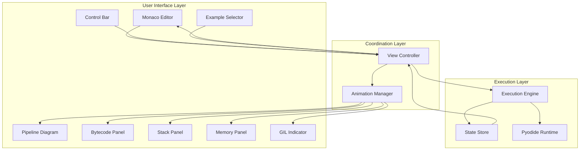

# Design Document: Python Execution Visualizer
(LAs indicaciones deben estar en español)

## Overview

The Python Execution Visualizer is a single-file HTML application that provides an interactive, educational tool for understanding CPython's execution pipeline. The system combines a code editor, execution engine, and multiple synchronized visualization panels to show how Python code transforms from source text through tokenization, parsing, compilation, bytecode generation, and finally runtime execution with visible call stack, memory allocation, and GIL status.

The architecture follows a state-machine pattern where the execution engine pre-computes all execution states, allowing bidirectional navigation through program execution. All components are implemented in vanilla JavaScript with CSS animations, using CDN-loaded dependencies (Monaco Editor for code editing and Pyodide for Python execution).

### Key Design Goals

- Zero-installation deployment: single HTML file with CDN dependencies
- Educational clarity: visual representations prioritize understanding over performance
- Synchronized updates: all panels reflect the same execution state consistently
- Smooth animations: CSS transitions provide visual continuity between states
- Desktop-optimized layout: designed for 1920×1080 or larger displays

## Architecture

### System Components



### Component Responsibilities

**Monaco Editor**: Provides syntax-highlighted code editing with line highlighting for current execution position.

**Pipeline Diagram**: Animates the six-stage CPython pipeline (Source → Tokenizer → Parser → Compiler → Bytecode → PVM) with visual highlighting of the active stage.

**Bytecode Panel**: Displays compiled bytecode instructions with offset numbers and highlights the current instruction pointer.

**Stack Panel**: Visualizes function call frames as vertically stacked cards showing function names, local variables, and return addresses.

**Memory Panel**: Shows heap objects (integers, strings, lists, dictionaries) with visual arrows from variable names to their referenced objects.

**GIL Indicator**: Displays Global Interpreter Lock status (ACQUIRED/RELEASED) with color coding and thread ID.

**Control Bar**: Provides execution controls (Step Forward, Step Back, Auto-play, Reset, Speed Slider, Explain).

**Example Selector**: Dropdown menu for loading preloaded code examples.

**Execution Engine**: Orchestrates Python code execution using Pyodide, generates bytecode via dis module, and captures execution state snapshots.

**State Store**: Maintains the array of pre-computed execution states enabling bidirectional navigation.

**View Controller**: Coordinates updates across all UI components when execution state changes.

**Animation Manager**: Handles CSS transition timing and synchronization for smooth visual updates.

### Data Flow

1. User writes code in Monaco Editor or selects an example
2. User clicks execution control (Step Forward, Auto-play, etc.)
3. View Controller receives control event
4. If first execution, Execution Engine compiles code via Pyodide and pre-computes all states
5. View Controller updates current state index in State Store
6. View Controller triggers Animation Manager for synchronized panel updates
7. Animation Manager updates all panels within 50ms window
8. CSS transitions provide smooth visual feedback

### Technology Stack

- **HTML5**: Single-file container
- **CSS3**: Dark theme styling and transitions
- **Vanilla JavaScript**: Application logic (no frameworks)
- **Monaco Editor**: Code editor (CDN: cdnjs.cloudflare.com or unpkg.com)
- **Pyodide**: Python runtime in browser (CDN: cdn.jsdelivr.net/pyodide)

## Components and Interfaces

### Execution Engine

```javascript
class ExecutionEngine {
  constructor(pyodideInstance) {
    this.pyodide = pyodideInstance;
    this.states = [];
    this.currentIndex = 0;
  }
  
  // Compiles Python code and generates all execution states
  async compile(sourceCode) {
    // Returns: { success: boolean, states: ExecutionState[], error: string }
  }
  
  // Retrieves bytecode using Pyodide's dis module
  async getBytecode(sourceCode) {
    // Returns: BytecodeInstruction[]
  }
  
  // Executes Python code step-by-step, capturing states
  async captureStates(sourceCode) {
    // Returns: ExecutionState[]
  }
}
```

### State Store

```javascript
class StateStore {
  constructor() {
    this.states = [];
    this.currentIndex = 0;
  }
  
  setStates(states) {
    this.states = states;
    this.currentIndex = 0;
  }
  
  getCurrentState() {
    return this.states[this.currentIndex];
  }
  
  stepForward() {
    if (this.currentIndex < this.states.length - 1) {
      this.currentIndex++;
      return true;
    }
    return false;
  }
  
  stepBack() {
    if (this.currentIndex > 0) {
      this.currentIndex--;
      return true;
    }
    return false;
  }
  
  reset() {
    this.currentIndex = 0;
  }
  
  canStepForward() {
    return this.currentIndex < this.states.length - 1;
  }
  
  canStepBack() {
    return this.currentIndex > 0;
  }
}
```

### View Controller

```javascript
class ViewController {
  constructor(stateStore, animationManager) {
    this.stateStore = stateStore;
    this.animationManager = animationManager;
  }
  
  // Updates all panels to reflect current state
  updateViews() {
    const state = this.stateStore.getCurrentState();
    this.animationManager.updateAll(state);
  }
  
  // Handles step forward control
  onStepForward() {
    if (this.stateStore.stepForward()) {
      this.updateViews();
    }
  }
  
  // Handles step back control
  onStepBack() {
    if (this.stateStore.stepBack()) {
      this.updateViews();
    }
  }
  
  // Handles reset control
  onReset() {
    this.stateStore.reset();
    this.updateViews();
  }
  
  // Handles auto-play with configurable speed
  startAutoPlay(speedMultiplier) {
    // speedMultiplier: 0.5x to 3x
  }
  
  stopAutoPlay() {
    // Stops auto-play interval
  }
}
```

### Animation Manager

```javascript
class AnimationManager {
  constructor(panels) {
    this.monacoEditor = panels.monacoEditor;
    this.pipelineDiagram = panels.pipelineDiagram;
    this.bytecodePanel = panels.bytecodePanel;
    this.stackPanel = panels.stackPanel;
    this.memoryPanel = panels.memoryPanel;
    this.gilIndicator = panels.gilIndicator;
  }
  
  // Synchronously updates all panels within 50ms
  updateAll(state) {
    const startTime = performance.now();
    
    this.updateMonacoHighlight(state.lineNumber);
    this.updatePipelineStage(state.pipelineStage);
    this.updateBytecodePointer(state.instructionPointer);
    this.updateStackFrames(state.callStack);
    this.updateMemoryObjects(state.heap);
    this.updateGILStatus(state.gilStatus);
    
    const elapsed = performance.now() - startTime;
    console.assert(elapsed < 50, "Update exceeded 50ms budget");
  }
  
  updateMonacoHighlight(lineNumber) {
    // Highlights the specified line in Monaco Editor
  }
  
  updatePipelineStage(stage) {
    // Animates the active pipeline stage
    // stage: 'source' | 'tokenizer' | 'parser' | 'compiler' | 'bytecode' | 'pvm'
  }
  
  updateBytecodePointer(instructionPointer) {
    // Highlights the current bytecode instruction
  }
  
  updateStackFrames(callStack) {
    // Animates stack frame push/pop with CSS transitions
  }
  
  updateMemoryObjects(heap) {
    // Animates object allocation/deallocation
  }
  
  updateGILStatus(gilStatus) {
    // Updates GIL indicator color and thread ID
  }
}
```

### Panel Interfaces

Each visualization panel implements a common interface:

```javascript
class Panel {
  constructor(domElement) {
    this.element = domElement;
  }
  
  // Updates panel content based on execution state
  update(stateData) {
    // Implementation varies by panel type
  }
  
  // Applies CSS transition for smooth animation
  animate(transitionType, duration) {
    // transitionType: 'push' | 'pop' | 'highlight' | 'fade'
    // duration: 200-500ms
  }
}
```

## Data Models

### ExecutionState

Represents a complete snapshot of program state at a single execution step.

```javascript
{
  stepNumber: number,           // Sequential step index
  lineNumber: number,           // Current source code line
  pipelineStage: string,        // 'source' | 'tokenizer' | 'parser' | 'compiler' | 'bytecode' | 'pvm'
  instructionPointer: number,   // Current bytecode offset
  bytecode: BytecodeInstruction[], // Complete bytecode listing
  callStack: StackFrame[],      // Function call stack
  heap: HeapObject[],           // Memory objects
  gilStatus: GILStatus,         // GIL state
  explanation: string           // Human-readable step description
}
```

### BytecodeInstruction

Represents a single Python bytecode instruction.

```javascript
{
  offset: number,               // Bytecode offset
  opname: string,               // Instruction name (e.g., 'LOAD_FAST', 'CALL_FUNCTION')
  arg: number | null,           // Instruction argument (if applicable)
  argval: any | null,           // Resolved argument value
  lineno: number                // Corresponding source line number
}
```

### StackFrame

Represents a function call frame on the call stack.

```javascript
{
  frameId: string,              // Unique frame identifier
  functionName: string,         // Function name
  localVariables: Map<string, any>, // Local variable bindings
  returnAddress: number,        // Bytecode offset to return to
  lineNumber: number            // Current line in this frame
}
```

### HeapObject

Represents an object allocated in memory.

```javascript
{
  objectId: string,             // Unique object identifier
  type: string,                 // 'int' | 'str' | 'list' | 'dict' | 'function'
  value: any,                   // Object value
  refCount: number,             // Reference count
  references: string[]          // IDs of objects this object references
}
```

### GILStatus

Represents the Global Interpreter Lock state.

```javascript
{
  state: string,                // 'ACQUIRED' | 'RELEASED'
  threadId: number,             // Thread holding the GIL (or -1 if released)
  explanation: string           // Tooltip text explaining GIL purpose
}
```

### CodeExample

Represents a preloaded code example.

```javascript
{
  name: string,                 // Display name in dropdown
  description: string,          // Brief description
  code: string                  // Python source code
}
```

### Layout Configuration

The viewport is divided into regions optimized for 1920×1080 displays:

```javascript
{
  monacoEditor: {
    width: '30%',
    height: '100%',
    position: 'left'
  },
  pipelineDiagram: {
    width: '70%',
    height: '20%',
    position: 'top-center'
  },
  bytecodePanel: {
    width: '35%',
    height: '60%',
    position: 'center-left'
  },
  stackPanel: {
    width: '35%',
    height: '60%',
    position: 'center-center'
  },
  memoryPanel: {
    width: '30%',
    height: '80%',
    position: 'right'
  },
  gilIndicator: {
    width: '200px',
    height: '40px',
    position: 'top-right'
  },
  controlBar: {
    width: '70%',
    height: '20%',
    position: 'bottom-center'
  }
}
```

### Theme Configuration

```javascript
{
  colors: {
    background: '#0d1117',
    accent: '#58a6ff',
    text: '#c9d1d9',
    border: 'rgba(255, 255, 255, 0.1)',
    gilAcquired: '#3fb950',
    gilReleased: '#f85149'
  },
  transitions: {
    duration: '300ms',
    easing: 'ease-in-out'
  }
}
```


## Correctness Properties

A property is a characteristic or behavior that should hold true across all valid executions of a system—essentially, a formal statement about what the system should do. Properties serve as the bridge between human-readable specifications and machine-verifiable correctness guarantees.

### Property 1: Monaco Editor Line Highlighting Synchronization

For any execution step, the Monaco Editor's highlighted line number should match the line number in that step's execution state.

**Validates: Requirements 1.4**

### Property 2: Pipeline Stage Highlighting Synchronization

For any execution step, the Pipeline Diagram's highlighted stage should match the pipeline stage in that step's execution state.

**Validates: Requirements 2.2**

### Property 3: Bytecode Instruction Completeness

For any bytecode instruction generated by the execution engine, the Bytecode Panel display should include the instruction's offset number, operation name (opname), and argument value (if the instruction has an argument).

**Validates: Requirements 3.2, 3.3, 3.5**

### Property 4: Bytecode Compilation Produces Instructions

For any valid Python source code, after compilation by the execution engine, the Bytecode Panel should contain at least one bytecode instruction.

**Validates: Requirements 3.1**

### Property 5: Bytecode Pointer Synchronization

For any execution step, the Bytecode Panel's highlighted instruction should be at the offset matching that step's instruction pointer.

**Validates: Requirements 3.4**

### Property 6: Stack Frame Display Completeness

For any stack frame in an execution state, the Stack Panel display should include the function name, all local variables with their values, and the return address.

**Validates: Requirements 4.4**

### Property 7: Stack Frame Ordering

For any execution state with multiple stack frames, the topmost displayed frame in the Stack Panel should be the most recently called function (the last frame in the call stack array).

**Validates: Requirements 4.5**

### Property 8: Memory Object Display

For any heap object of type integer, string, list, or dictionary in an execution state, that object should be displayed in the Memory Panel.

**Validates: Requirements 5.1**

### Property 9: Variable Reference Visualization

For any variable reference in an execution state, the Memory Panel should display a visual connection (arrow) from the variable name to its referenced object.

**Validates: Requirements 5.2**

### Property 10: GIL Status Display

For any execution state, the GIL Indicator should display the GIL state (ACQUIRED or RELEASED) and thread ID from that execution state.

**Validates: Requirements 6.2, 6.5**

### Property 11: Python Language Construct Support

For any valid Python code containing variable assignments, function definitions, function calls, loop constructs (for/while), conditional statements (if/elif/else), or basic data structures (lists/dictionaries), the execution engine should successfully compile and execute it, producing execution states.

**Validates: Requirements 7.2, 7.3, 7.4, 7.5, 7.6**

### Property 12: Execution State Completeness

For any execution step generated by the execution engine, the corresponding ExecutionState should contain all required fields: stepNumber, lineNumber, pipelineStage, instructionPointer, bytecode, callStack, heap, gilStatus, and explanation.

**Validates: Requirements 7.9**

### Property 13: Step Forward Advances State

For any execution state where the current index is not at the end of the states array, calling stepForward should increment the current index by exactly one.

**Validates: Requirements 8.6**

### Property 14: Step Back Reverses State

For any execution state where the current index is not at the beginning of the states array, calling stepBack should decrement the current index by exactly one.

**Validates: Requirements 8.7**

### Property 15: Reset Returns to Initial State

For any execution state at any index, calling reset should set the current index to zero.

**Validates: Requirements 8.9**

### Property 16: Step Explanation Display

For any execution step, clicking the "Explain this step" button should display the explanation text from that step's execution state.

**Validates: Requirements 9.2**

### Property 17: Explanation Content Completeness

For any execution step, the explanation text should mention the bytecode instruction being executed, and if the step modifies the call stack or memory, the explanation should mention those effects.

**Validates: Requirements 9.3, 9.4, 9.5**

### Property 18: Example Selection Loads Code and Resets

For any code example selection, the Monaco Editor content should match the example's code, and the execution state index should be reset to zero.

**Validates: Requirements 10.5, 10.6**

### Property 19: Synchronized Panel Updates

For any state change (step forward or step back), all six panels (Monaco Editor, Pipeline Diagram, Bytecode Panel, Stack Panel, Memory Panel, GIL Indicator) should complete their updates within 50ms total.

**Validates: Requirements 11.1, 11.2, 11.3, 11.4, 11.5, 11.6**

### Property 20: Error Handling for Invalid Code

For any invalid Python code entered by the user, the execution engine should fail gracefully and display a descriptive error message without crashing the application.

**Validates: Requirements 14.5, 14.6**

## Error Handling

### Compilation Errors

When the user enters invalid Python syntax, Pyodide will throw a SyntaxError. The execution engine catches this exception and displays a user-friendly error message in a modal dialog:

```javascript
async compile(sourceCode) {
  try {
    await this.pyodide.runPythonAsync(sourceCode);
    // ... capture states
  } catch (error) {
    return {
      success: false,
      states: [],
      error: `Compilation Error: ${error.message}\n\nPlease check your Python syntax and try again.`
    };
  }
}
```

### Runtime Errors

When Python code raises an exception during execution (e.g., ZeroDivisionError, NameError), the execution engine captures the error state and includes it in the execution states array. The error state includes:

- The line number where the error occurred
- The exception type and message
- The call stack at the time of the error

The user can step through execution up to the point of the error, allowing them to understand what led to the failure.

### CDN Loading Failures

If Monaco Editor or Pyodide fail to load from their CDN URLs, the application displays a loading error message:

```javascript
window.addEventListener('load', async () => {
  try {
    // Wait for Monaco to load
    if (typeof monaco === 'undefined') {
      throw new Error('Monaco Editor failed to load from CDN');
    }
    
    // Load Pyodide
    const pyodide = await loadPyodide();
    if (!pyodide) {
      throw new Error('Pyodide failed to load from CDN');
    }
    
    // Initialize application
    initializeApp(pyodide);
  } catch (error) {
    document.body.innerHTML = `
      <div style="color: #f85149; padding: 20px; font-family: monospace;">
        <h2>Loading Error</h2>
        <p>${error.message}</p>
        <p>Please check your internet connection and refresh the page.</p>
      </div>
    `;
  }
});
```

### State Boundary Errors

The StateStore prevents out-of-bounds access by checking array boundaries before stepping:

```javascript
stepForward() {
  if (this.currentIndex >= this.states.length - 1) {
    console.warn('Already at the last step');
    return false;
  }
  this.currentIndex++;
  return true;
}

stepBack() {
  if (this.currentIndex <= 0) {
    console.warn('Already at the first step');
    return false;
  }
  this.currentIndex--;
  return true;
}
```

The UI disables Step Forward/Back buttons when at boundaries to prevent user confusion.

### Animation Performance Degradation

If panel updates exceed the 50ms budget (detected via performance.now()), the Animation Manager logs a warning and continues execution. This prevents the application from hanging but alerts developers to performance issues:

```javascript
updateAll(state) {
  const startTime = performance.now();
  
  // ... update all panels
  
  const elapsed = performance.now() - startTime;
  if (elapsed > 50) {
    console.warn(`Panel update took ${elapsed.toFixed(2)}ms (exceeds 50ms budget)`);
  }
}
```

### Memory Exhaustion

For very large programs with thousands of execution steps, the browser may run out of memory when storing all states. The execution engine limits state capture to a maximum of 10,000 steps:

```javascript
async captureStates(sourceCode) {
  const states = [];
  const MAX_STEPS = 10000;
  
  while (hasMoreSteps() && states.length < MAX_STEPS) {
    states.push(captureCurrentState());
    executeNextStep();
  }
  
  if (states.length >= MAX_STEPS) {
    console.warn('Execution limited to 10,000 steps to prevent memory exhaustion');
  }
  
  return states;
}
```

## Testing Strategy

### Dual Testing Approach

The Python Execution Visualizer requires both unit testing and property-based testing for comprehensive coverage:

- **Unit tests** verify specific examples, edge cases, UI interactions, and error conditions
- **Property tests** verify universal properties across all inputs using randomized test data

Both testing approaches are complementary and necessary. Unit tests catch concrete bugs in specific scenarios, while property tests verify general correctness across a wide range of inputs.

### Property-Based Testing

We will use **fast-check** (JavaScript property-based testing library) to implement the 20 correctness properties defined above. Each property test will:

- Run a minimum of 100 iterations with randomized inputs
- Include a comment tag referencing the design property: `// Feature: python-execution-visualizer, Property N: [property text]`
- Generate random but valid test data (execution states, Python code snippets, etc.)

Example property test structure:

```javascript
const fc = require('fast-check');

// Feature: python-execution-visualizer, Property 1: Monaco Editor Line Highlighting Synchronization
test('Monaco Editor highlights the correct line for any execution step', () => {
  fc.assert(
    fc.property(
      fc.record({
        stepNumber: fc.nat(),
        lineNumber: fc.integer({ min: 1, max: 100 }),
        // ... other ExecutionState fields
      }),
      (executionState) => {
        const highlightedLine = monacoEditor.getHighlightedLine();
        return highlightedLine === executionState.lineNumber;
      }
    ),
    { numRuns: 100 }
  );
});
```

### Unit Testing

Unit tests will focus on:

1. **UI Component Rendering**: Verify that panels render correctly with specific data
2. **Control Interactions**: Test button clicks, slider changes, dropdown selections
3. **Edge Cases**: Empty code, single-line programs, maximum step limits
4. **Error Conditions**: Invalid syntax, runtime errors, CDN failures
5. **Animation Timing**: Verify CSS transition durations match specifications
6. **Layout Verification**: Check that panels occupy correct viewport regions
7. **Theme Consistency**: Verify color values match design specifications

Example unit test:

```javascript
test('Step Forward button is disabled at the last step', () => {
  const stateStore = new StateStore();
  stateStore.setStates([state1, state2, state3]);
  stateStore.currentIndex = 2; // Last step
  
  const stepForwardButton = document.getElementById('step-forward');
  updateControlButtons(stateStore);
  
  expect(stepForwardButton.disabled).toBe(true);
});
```

### Integration Testing

Integration tests verify that components work together correctly:

1. **End-to-End Execution Flow**: Load example → compile → step through → verify all panels update
2. **Synchronized Updates**: Verify all panels update within 50ms budget
3. **State Persistence**: Verify stepping forward then backward returns to the same state
4. **Example Loading**: Verify selecting an example loads code and resets state

### Test Data Generation

For property-based tests, we need generators for:

- **Valid Python code snippets**: Variable assignments, function definitions, loops, conditionals
- **ExecutionState objects**: With valid field values and internal consistency
- **BytecodeInstruction arrays**: With realistic opnames and arguments
- **StackFrame objects**: With function names and local variables
- **HeapObject objects**: With various types (int, str, list, dict)

### Performance Testing

While not part of automated testing, manual performance testing should verify:

- Panel updates complete within 50ms for typical programs (< 1000 steps)
- Auto-play runs smoothly at all speed settings (0.5x to 3x)
- Memory usage remains reasonable for programs with up to 10,000 steps
- Initial load time is acceptable (< 5 seconds on typical broadband)

### Browser Compatibility Testing

Manual testing should verify functionality in:

- Chrome (latest version)
- Firefox (latest version)
- Safari (latest version)
- Edge (latest version)

### Test Configuration

All property-based tests will be configured with:

```javascript
{
  numRuns: 100,           // Minimum 100 iterations per property
  verbose: true,          // Show detailed failure information
  seed: Date.now(),       // Reproducible test runs
  endOnFailure: false     // Run all iterations even after failure
}
```

### Continuous Integration

Tests should run automatically on:

- Every commit to the repository
- Pull request creation and updates
- Scheduled daily runs to catch flaky tests

The CI pipeline should fail if:

- Any unit test fails
- Any property test fails
- Code coverage drops below 80%
- Linting errors are present

